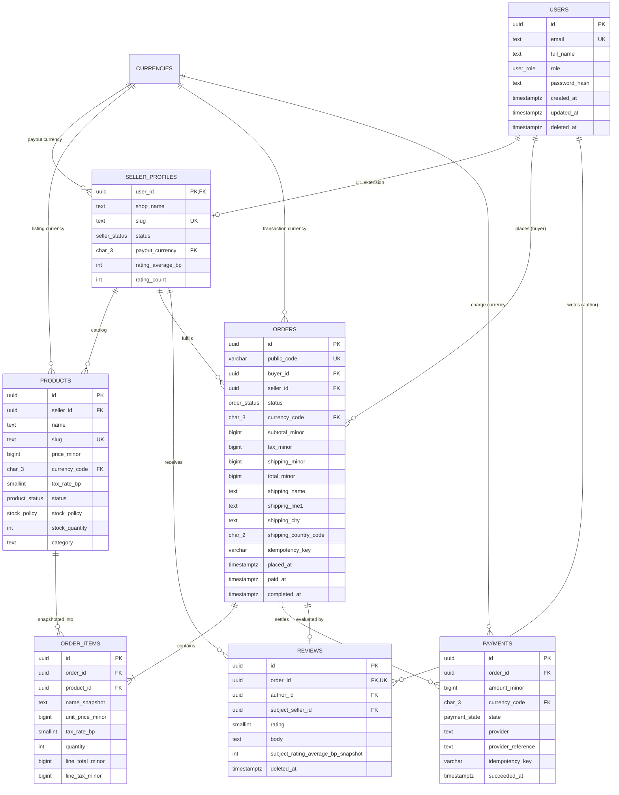
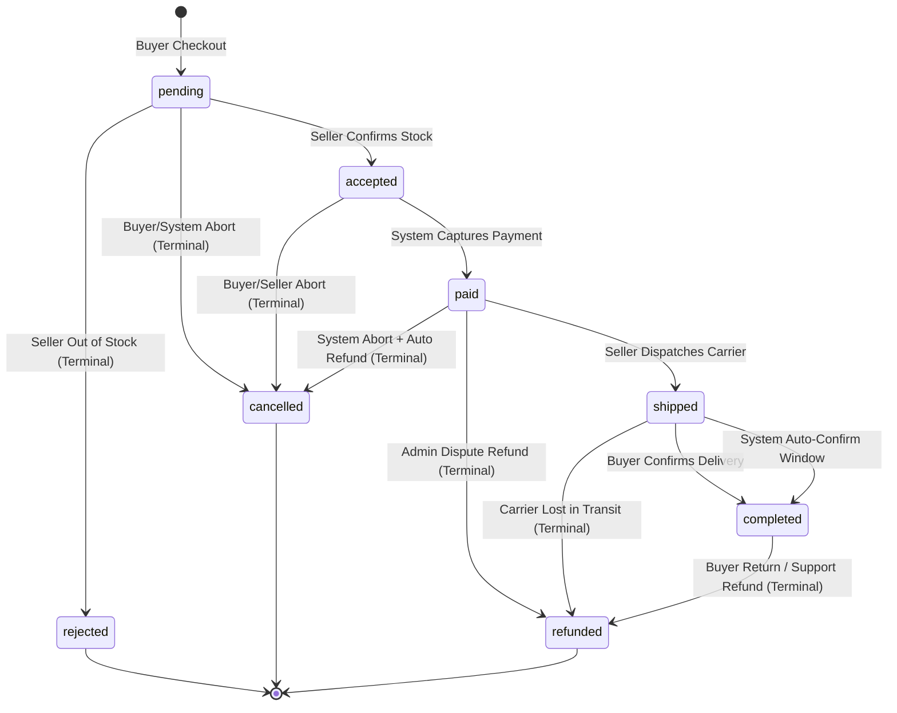

# Marketplace Order Management — API Design & Data Modeling

> **Product Engineering Bootcamp — Task 3**  
> Complete API design document, formal data model, and database-enforced invariants for a multi-vendor marketplace built on PostgreSQL 17, Prisma ORM, and Next.js.

---

## How This Document Meets Task 3 (Index for the Reviewer)

Every requirement is implemented **and** backed by runnable evidence. The column on the right is where you look to verify it.

> **Scope, stated plainly (the brief says "implement only the schema").** Task 3's deliverable is the document + the schema + the proofs, all in this repository. The small HTTP surface marked `(implemented)` in §4.1 (products browse, order creation, the transition endpoint) is *compiled evidence of the model* — it exists so the contract in §4.1 is not a drawing of something no one has run, and it doubles as the Task 1–2 portfolio surface. Nothing in the schema is gated on those routes; remove them and every proof, query plan, and defense answer above still holds.

| Requirement from the brief | Where it is satisfied | Evidence |
|---|---|---|
| Product marketplace with buyers and two or more distinct seller domains | §1.1–1.2, §2 | Two seeded sellers in distinct domains: **Lagos Leatherworks** (leather goods) and **Port Harcourt Spice Traders** (spices, zero-tax pantry) — `scripts/seed.ts`; schema `db/migrations/002_identity.sql` |
| **Five most important actions** | §1.3 – mapped to endpoints in §4.1 | §4.1.1 browse `(implemented)`, §4.1.2 shopfront, §4.1.3 order history + detail, §4.1.3 queue |
| **Complete data model** covering products, sellers, buyers, orders, payments, and reviews | Step 2 (ERD diagram, §2.1 entity definitions, §2.2 relationships, §2.3 attributes) | 9 migration scripts in `db/migrations/002..006`; live schema (`npm run db:migrate`); ERD diagram §2 |
| Primary keys: natural for money, surrogate elsewhere | §3.5 | `currencies` (natural `code:`bpchar) vs `uuid` everywhere else |
| **API design document on top of the model** | Step 4 | §4.1 full versioned endpoint contracts (every resource, every error, idempotency) |
| Complete endpoint contracts including errors and idempotency | §4.1 (Conventions + per-resource contracts) | Orders POST enforced idempotent by Proof 26; contract §4.1.3 |
| Money never stored as floats | §3.2, §4.1 Conventions | Domain `minor_units` + amount CHECKs (Proofs 10–14); API money fields are integer minor units |
| Search and pagination | §1.3 Action 1; §4.1.1 | Query 01 `(implemented)`; weighted `tsvector` search via GIN `products_search_gin_idx` (`007_indexes.sql`); Proof 27 covers one-line-per-product |
| Validations as **database CHECKs, not just app code** | §3.6 | 29 rejected-invalid proofs with named constraints, §5.1 |
| **Three scientific queries** (order history, queue, search) | §1.3 Actions 3 & 4; §4.1.3 | `db/queries/03_buyer_orders.sql`, `04_seller_orders.sql`; text search is the `search_document @@ plainto_tsquery` filter inside `01_browse_products.sql` (via `products_search_gin_idx`) |
| Explain on the two heaviest queries to confirm indexes are used | §3.7, §5.2 | `npm run db:queries` Phase B **asserts** index use (no `enable_seqscan`); screenshots in `docs/evidence/plan-*.png` |
| **Try three invalid inserts and show the database rejecting them** | §5.3 | Proofs 1, 18, 21 + screenshots `docs/evidence/violation-*.png`, full transcript `docs/evidence/constraint-proofs-transcript.txt` |
| Responses structured (not naked rows) | §4.1 response envelopes | Envelope spec + live responses at https://api-design-and-data-modeling.vercel.app (local: `http://localhost:4321`) |
| **Model maps to API** (endpoints reference model entities 1:1) | §4.1 ↔ §2 | Each resource's paths reference the `products/sellers/orders/payments/reviews` relations by name |
| Impossible states prevented at the database | §3.3 + §3.6 | Guard trigger + 8 tied CHECKs; Proofs 1–9 walk the whole machine |
| Incremental commit history | Repository with 8 themed commits (scaffold → schema/migrations → proofs → data layer → API → UI → docs → deploy) | https://github.com/joshua468/API-Design-and-Data-Modeling |
| Live deployment | Embedded PGlite, self-bootstrapping on cold start (no external database) | https://api-design-and-data-modeling.vercel.app |

Run the evidence for yourself: `npm run db:seed` → `npm run db:proofs` (34/34) → `npm run db:queries` (2/2 plan assertions) → `npx vitest run` (58/58) → `next dev` and poke the live endpoints (§4.1 "implemented" markers).

---

## Table of Contents
- [Quickstart](#quickstart)
1. [Step 1: Requirements Specification](#step-1-requirements-specification)
2. [Step 2: Entity Modeling & Relationships (ERD)](#step-2-entity-modeling--relationships-erd)
3. [Step 3: The Seven Hard Questions](#step-3-the-seven-hard-questions)
   - [3.1 Normalisation & Deliberate Denormalisations](#31-normalisation--deliberate-denormalisations)
   - [3.2 Money Representation & Arithmetic](#32-money-representation--arithmetic)
   - [3.3 Status & State Machine Architecture](#33-status--state-machine-architecture)
   - [3.4 Time & Deletion Lifecycle](#34-time--deletion-lifecycle)
   - [3.5 Identifier Strategy & Security](#35-identifier-strategy--security)
   - [3.6 Database Constraints & Impossible States](#36-database-constraints--impossible-states)
   - [3.7 Indexing Strategy & Query Plans](#37-indexing-strategy--query-plans)
4. [Step 4: API Design on Top of the Model](#step-4-api-design-on-top-of-the-model)
   - [4.1 Versioned Endpoint Contracts](#41-versioned-endpoint-contracts)
   - [4.2 Over-fetching Analysis: REST vs. GraphQL](#42-over-fetching-analysis-rest-vs-graphql)
   - [4.3 Real-Time Architecture: WebSockets vs. SSE](#43-real-time-architecture-websockets-vs-sse)
5. [Step 5: Proofs, Verification & Query Plans](#step-5-proofs-verification--query-plans)
   - [5.1 34 Constraint Proofs (Negative & Control)](#51-34-constraint-proofs-negative--control)
   - [5.2 EXPLAIN Query Plans (two heaviest, Phase A Seed vs. Phase B 30k Scale)](#52-explain-query-plans-two-heaviest-phase-a-seed-vs-phase-b-30k-scale)
   - [5.3 Three Rejected Invalid States (Screenshots in docs/evidence)](#53-three-rejected-invalid-states-screenshots-in-docsevidence)
6. [Prisma ORM & Tooling Integration](#prisma-orm--tooling-integration)
7. [Defence Preparation](#defence-preparation)
8. [Public Post](#public-post)

---

## Quickstart

Clone the repo and run the whole thing — no external services required.

**Prerequisites**: Node.js ≥ 22. A networked PostgreSQL is optional: without `DATABASE_URL` the app runs on the embedded PGlite database and every script stays hermetic.

```bash
npm install                       # or: npm ci
cp .env.example .env.local        # Windows PowerShell: Copy-Item .env.example .env.local

npm run db:setup                  # one command: reset -> migrate -> seed -> proofs (34/34) -> queries (2/2)
npx vitest run                    # 58 API + money tests, embedded PGlite, no network
npm run dev                       # web app at http://localhost:4321
```

**Points to hit once it's up**:
- `http://localhost:4321/api/v1/probe` — a live query through the Prisma data layer (reports host/port/engine/row counts).
- `http://localhost:4321/api/v1/health` — database availability + migration/product/order counts.
- `http://localhost:4321/api/v1/products?category=spices` — a filtering + pagination example.

**What each script does** (idempotent, re-runnable):

| Command | What it proves |
| :--- | :--- |
| `npm run db:migrate` | applies `db/migrations/*.sql` (9 migrations: domains, CHECKs, triggers, partial indexes) |
| `npm run db:seed` | demo data: 2 sellers, buyers, products, orders, payments, reviews |
| `npm run db:proofs` | 34 checks — 29 invalid states rejected by the DB + 5 controls that must succeed |
| `npm run db:queries` | 7 scientific queries; EXPLAIN Phase A (seed) + Phase B (~10–20k rows) on the two heaviest, **asserting** index use |
| `npx vitest run` | 58 tests (API contracts, idempotency, money arithmetic) |
| `npm run typecheck` / `npm run lint` | `tsc --noEmit` / `eslint .` — both clean |
| `npm run verify` | the full pipeline: typecheck → lint → db:setup → tests → build |

**Demo accounts** (password `portfolio-demo-password`): buyer `adaeze@example.test`, seller `hello@lagosleatherworks.test`. There is no login route — sessions are signed cookies (`mp_session = <userId>.<HMAC-SHA256>`), minted the same way the future login route will sign them; see `src/server/auth/session.ts`.

**Networking with a real server**: set `DATABASE_URL=postgresql://marketplace_app:…@127.0.0.1:5432/marketplace` (PostgreSQL 17) and `next dev` uses the Prisma data layer against it; tests still force PGlite. Full detail under *Prisma ORM & Tooling Integration*.

When in doubt, `npm run db:setup && npm run dev` is the whole product on one line.

---

## Step 1: Requirements Specification

### 1.1 Product Scope
Marketplace Order Management is a multi-vendor commerce platform where independent artisans and merchants list goods, buyers place and track multi-item single-vendor orders, payments are captured and reconciled, and verified delivery enables counterparty reviews.

### 1.2 User Actors
- **Buyer**: Searches catalog, filters products by category/seller, places idempotent orders, tracks progress, confirms delivery, and writes verified reviews.
- **Seller**: Maintains shop profile, lists and prices products, manages stock levels, processes order queues in FIFO sequence, ships packages, and views customer reviews.
- **Admin**: Suspends fraudulent/violating sellers, resolves order disputes, and issues goodwill refunds.
- **System Worker**: Reconciles external payment provider webhooks and executes automated timeouts (e.g. payment window expiration, delivery auto-confirmation).

### 1.3 The Five Most Important User Actions
1. **Action 1 (Buyer Catalog Browse)**: A buyer browses active, sellable products filtered by category, price bounds, or text search, sorted cheapest first, paginated.
2. **Action 2 (Buyer Shop View)**: A buyer visits a seller's shopfront to view active listings, settlement currency, and aggregated review reputation.
3. **Action 3 (Buyer Order History)**: A buyer checks past and active orders with line count, financial breakdown, and delivery timestamps.
4. **Action 4 (Seller Queue Processing)**: A seller views actionable orders awaiting review in strict first-in-first-out (FIFO) sequence.
5. **Action 5 (Order Detail & Payment Audit)**: A buyer or support agent inspects a single order, its historical line item snapshots, tax rates, and reconciled payment attempts.

---

## Step 2: Entity Modeling & Relationships (ERD)

### 2.1 Entity Definitions
| Entity | One-Sentence Definition | Primary Key | Required Fields |
| :--- | :--- | :--- | :--- |
| **`User`** | A human account actor with authentication credentials and platform role. | `id` (UUIDv4) | `email`, `fullName`, `role`, `passwordHash` |
| **`SellerProfile`** | A 1:1 business extension of a User containing storefront metadata and rating metrics. | `userId` (UUIDv4 -> User.id) | `shopName`, `slug`, `status`, `payoutCurrency` |
| **`Currency`** | ISO 4217 currency reference data declaring decimal exponent and symbol. | `code` (CHAR(3)) | `exponent`, `name`, `symbol` |
| **`Product`** | A sellable catalog item owned by a specific seller profile. | `id` (UUIDv4) | `sellerId`, `name`, `slug`, `priceMinor`, `currencyCode`, `taxRateBp`, `status`, `category` |
| **`Order`** | A commercial contract between one buyer and one seller containing financial totals. | `id` (UUIDv4) | `publicCode`, `buyerId`, `sellerId`, `status`, `currencyCode`, `subtotalMinor`, `taxMinor`, `totalMinor`, `shippingName`, `shippingLine1`, `shippingCity`, `shippingCountryCode`, `idempotencyKey` |
| **`OrderItem`** | An immutable line item record with snapshotted pricing and tax at the moment of checkout. | `id` (UUIDv4) | `orderId`, `productId`, `nameSnapshot`, `unitPriceMinor`, `taxRateBp`, `quantity`, `lineTotalMinor`, `lineTaxMinor` |
| **`Payment`** | A monetary transaction attempt against an order, linked to an external provider. | `id` (UUIDv4) | `orderId`, `amountMinor`, `currencyCode`, `state`, `provider`, `idempotencyKey` |
| **`Review`** | A post-delivery transaction rating and feedback submitted by the purchasing buyer. | `id` (UUIDv4) | `orderId`, `authorId`, `subjectSellerId`, `rating` |
| **`OrderStatusTransition`**| The relational lookup table defining all valid state transitions and allowed actors. | `(fromStatus, toStatus, actor)` | `requiresRefund`, `rationale` |
| **`OrderTerminalState`**| Lookup table defining final lifecycle states that cannot transition further. | `status` | `rationale` |

### 2.2 Cardinalities
- `User` 1:0..1 `SellerProfile` (Profile inherits `userId` as PK/FK)
- `User` 1:N `Order` (Buyer places many orders)
- `SellerProfile` 1:N `Product` (Seller publishes many products)
- `SellerProfile` 1:N `Order` (Seller receives many orders)
- `Order` 1:N `OrderItem` (Order contains 1 or more line items)
- `Product` 1:N `OrderItem` (Product referenced across orders)
- `Order` 1:N `Payment` (Order has 1..N payment attempts, max 1 active/succeeded)
- `Order` 1:0..1 `Review` (Order may be reviewed once by purchasing buyer)
- `SellerProfile` 1:N `Review` (Seller accumulates reviews)

### 2.3 Entity Relationship Diagram (ERD)



---

## Step 3: The Seven Hard Questions

### 3.1 Normalisation & Deliberate Denormalisations
We enforce 3rd Normal Form for identity and configuration, but deliberately introduce **three denormalisations** with architectural justification:

1. **Shipping Address Snapshot on `orders` (`shipping_name`, `shipping_line1`, `shipping_city`, `shipping_country_code`)**:
   - *Rationale*: An order is a legally binding financial tax invoice. If a user updates their profile address tomorrow, past receipts must still reflect the physical location where the parcel was dispatched. Referencing a mutable `user_addresses` foreign key would cause retroactive data distortion.
2. **Line Item Price & Name Snapshots on `order_items` (`name_snapshot`, `unit_price_minor`, `tax_rate_bp`)**:
   - *Rationale*: A merchant can change product pricing or tax rates at any time. When an order is placed, `order_items` freezes the unit price and basis-point tax rate at checkout.
3. **Maintained Seller Rating Aggregate on `seller_profiles` (`rating_average_bp`, `rating_count`)**:
   - *Rationale*: Catalogue browsing requires displaying "4.8 ★ (120 reviews)" across 24 products per page. Recalculating `AVG(rating)` and `COUNT(*)` over a million review rows on every browse request would ruin database performance. An atomic trigger recomputes these integers on review insert/update.

### 3.2 Money Representation & Arithmetic
- **Minor Unit Rule**: All monetary values are stored as positive integers in the currency's smallest non-fractional unit (`minor_units` domain over `BIGINT >= 0`). Floats and decimals are prohibited.
- **Explicit Currency Pairing**: Every amount column has an adjacent `currency_code_t` (CHAR(3)) foreign key referencing `currencies.code`.
- **Exponent Handling**: The `currencies` table stores the subdivision exponent (e.g., NGN: 2 -> ₦100.00; USD: 2 -> $100.00; JPY: 0 -> ¥100; KWD: 3 -> 0.100 KD).
- **Arithmetic Identity**: `total_minor = subtotal_minor + tax_minor + shipping_minor` is strictly validated by the check constraint `orders_total_identity`.

### 3.3 Status & State Machine Architecture
Order progression is **data-driven**, stored in `order_status_transitions` and enforced via `guard_order_status_transition()`:



#### Transition Enforcement:
1. **Self-loops forbidden**: `CHECK (from_status <> to_status)` prevents redundant state re-entry.
2. **Terminal state permanence**: States `rejected`, `cancelled`, and `refunded` have no outgoing edges.
3. **Actor Authorization**: Triggers verify the session GUC (`app.actor_role`, `app.actor_id`) to ensure buyers cannot accept orders and sellers cannot confirm their own delivery.

### 3.4 Time & Deletion Lifecycle
- **Timestamps**: Every table has `created_at` and trigger-maintained `updated_at`.
- **Soft Deletion (`deleted_at`)**: Used for `users` and `reviews` for GDPR/compliance reasons while keeping historical ledger integrity intact. Soft-deleted accounts release their lowercase email unique index via a partial index `WHERE deleted_at IS NULL`.
- **Strict Retention (No Soft Delete)**: `orders`, `order_items`, and `payments` are never soft-deleted because financial records must exist permanently for auditing and tax reconciliation.

### 3.5 Identifier Strategy & Security
- **Primary Keys**: Randomly generated UUIDv4 (`gen_random_uuid()`) preventing enumeration attacks (walking competitors' transaction volume).
- **Human Reference Codes (`public_code`)**: Format `ORD-XXXXXX` (e.g. `ORD-7K2QX9`) backed by a unique index (`orders_public_code_key`) for voice support and receipts without exposing raw database UUIDs.

### 3.6 Database Constraints & Impossible States
The schema enforces business invariants at the database level:
- **`payments_single_live_per_order`**: Unique partial index on `(order_id) WHERE state IN ('pending', 'succeeded')` preventing concurrent double charges.
- **`reviews_order_must_be_completed`**: Trigger ensuring a review cannot be inserted until `orders.completed_at IS NOT NULL`.
- **`order_items_single_seller_per_order`**: Trigger ensuring all items in an order belong to the same seller.
- **`order_items_immutable_after_payment`**: Trigger forbidding inserts, updates, or deletes on line items once `orders.status IN ('paid', 'shipped', 'completed')`.

### 3.7 Indexing Strategy & Query Plans
| Workflow Action | Index Name | Columns & Predicates | Query Served |
| :--- | :--- | :--- | :--- |
| **1. Browse Products** | `products_category_browse_idx` | `(category, price_minor, id) WHERE status = 'active'` | Category filter + price sort without memory sort |
| **2. Seller Shop** | `products_seller_active_idx` | `(seller_id, created_at DESC) WHERE status = 'active'` | Seller catalog newest first |
| **3. Buyer Orders** | `orders_buyer_recent_idx` | `(buyer_id, created_at DESC)` | Buyer order history timeline |
| **4. Seller Queue** | `orders_seller_queue_idx` | `(seller_id, placed_at, id) WHERE status = 'pending'` | FIFO actionable queue |
| **5. Order Items** | `order_items_order_idx` | `(order_id)` | Fast line item join |
| **Full-Text Search** | `products_search_gin_idx` | `GIN (search_document)` | Weighted keyword matching |

---

## Step 4: API Design on Top of the Model

### 4.1 Versioned Endpoint Contracts

#### Response Envelopes
- **Success Envelope**:
  ```json
  {
    "data": [ ... ],
    "meta": {
      "total": 142,
      "limit": 20,
      "offset": 0
    }
  }
  ```
- **Error Envelope**:
  ```json
  {
    "error": {
      "code": "invalid_pagination",
      "message": "One or more query parameters are invalid.",
      "details": {
        "limit": "Number must be less than or equal to 60"
      }
    }
  }
  ```

#### Conventions
- **Versioning**: every path starts `/api/v1/` from the first commit, so a future breaking change ships as `/v2` without breaking existing clients.
- **Pagination contract (every list endpoint)**: `limit` (default `20`, max `100`), `offset` (default `0`). Responses return `meta.limit`, `meta.offset`, `meta.total`, and `meta.hasMore` (a list endpoint never returns the whole collection when `limit` is omitted).
- **Filtering contract**: at least two filterable fields per list endpoint, passed as query params (e.g. `category`, `minPrice`/`maxPrice`).
- **Sorting contract**: `sort` (a named sort key, not a raw column) + `order` (`asc`/`desc`). An unknown `sort` key returns `400 invalid_request`, never a silent no-op sort.
- **Idempotency**: every mutating endpoint is repeatable — read-only endpoints are naturally idempotent; `POST /orders` is made idempotent by a required `Idempotency-Key` enforced by a partial unique index; `PATCH /orders/:id/transition` is idempotent at the resource level (the guard trigger refuses a transition that is not legal, and a repeated legal transition is a no-op). Successful replays return the original result with `Idempotent-Replay: true`.
- **Money**: all monetary fields are integer minor units (`priceMinor`, `totalMinor`, …) with a sibling `currencyCode`. There is no float anywhere in the API.

Implementations marked **(implemented)** are live at `http://localhost:4321`; the rest are the designed contracts the five actions imply, to be shipped in order.

#### 4.1.1 Products — Action 1: a buyer browses the catalogue `(implemented)`
`GET /api/v1/products`
- *Query params*: `category`, `minPriceMinor`, `maxPriceMinor`, `search`, `sort` (`price` | `newest`), `order` (`asc`|`desc`), `limit`, `offset`.
- *200*: `{ "data": [Product...], "meta": { "total", "limit", "offset", "hasMore" } }` where `Product` = `{ id, slug, name, priceMinor, currencyCode, category, sellerId, sellerShopName, createdAt }`.
- *400* `invalid_request`: unknown sort key, `limit > 100` (clamped is the alternative; see note below), negative `offset`, malformed `minPriceMinor`.
- *Curl*:
  ```bash
  curl -s "http://localhost:4321/api/v1/products?category=spices&limit=10&sort=price&order=asc"
  ```
- *Design note*: `limit` above 100 is **clamped to 100** (never honoured literally); a *negative* `offset` is rejected with 400 — the two ugliest inputs behave differently on purpose, and both are specified here.

`GET /api/v1/products/:id`
- *200*: single `Product`. *404* `not_found`; *400* `invalid_request` for a malformed identifier (never 500).

#### 4.1.2 Sellers — Action 2: a buyer opens a shopfront
`GET /api/v1/sellers/:id` — *200*: `{ id, shopName, slug, payoutCurrency, ratingAverageBp, ratingCount }`. *404* `not_found`.
`GET /api/v1/sellers/:id/products` — the shopfront catalogue; same pagination/filter contract as products, filtered to `status = 'active'`, sorted newest-first. *200* envelope; *404* `not_found`.

#### 4.1.3 Orders — Actions 3 & 5
`GET /api/v1/orders` — *Headers*: signed `mp_session` cookie (buyer sees their own; seller sees their shop's). *Query params*: `status` (`pending`|`accepted`|`paid`|`shipped`|`completed`|`cancelled`|`rejected`|`refunded`), `sort` (`newest`), `limit`, `offset`. *200* envelope of order summaries with `lineCount`, financial breakdown, and `placedAt`. *401* `unauthenticated`.
`GET /api/v1/orders/:id` — *200*: full order with historical `OrderItem` snapshots and `Payment` history (the audit view). *401* `unauthenticated`; *403* `not_your_order`; *404* `order_not_found`.
`POST /api/v1/orders` `(implemented)` — create an order (Action 3 readiness → payment).
- *Headers*: `Idempotency-Key` (required, 8–128 chars — a bare curl with a short key is a *controlled* 400, never a blind retry loop); `Cookie: mp_session=<userId>.<hmac>`.
- *Request Body*:
  ```json
  {
    "sellerId": "a1b2c3d4-0000-4000-8000-00000000000a",
    "shipping": { "name": "Adaeze Okonkwo", "line1": "14 Marina Road", "city": "Lagos", "countryCode": "NG" },
    "items": [ { "productId": "a1b2c3d4-0000-4000-8000-000000000067", "quantity": 1 } ]
  }
  ```
- *201*: `{ "orderId", "status": "pending", "totalMinor", "taxMinor", "shippingMinor", "currencyCode" }`.
- *200* replay + `Idempotent-Replay: true`; *400* `missing_idempotency_key` | `invalid_request`; *401* `unauthenticated`; *403* `not_your_order`; *404* `order_not_found`; *409* `idempotency_key_reused` | `insufficient_stock`; *422* `mixed_sellers` | `product_unavailable` | `seller_suspended`.
- *Idempotency mechanism*: the partial unique index `orders_buyer_idempotency_key`, plus an application lookup that replays the original result with the `Idempotent-Replay` header. See Proof 26 and §5.3.
`PATCH /api/v1/orders/:id/transition` `(implemented)` — drive the state machine (Action 4 and every other status change).
- *Request Body*: `{ "to": "accepted" }` where `to` is any `order_status`.
- *200*: `{ "id", "status", "publicCode" }`; *400* `invalid_request`; *401* `unauthenticated`; *403* `not_your_order` | `not_your_transition`; *404* `order_not_found`; *409* `illegal_status_transition` (`sqlstate` + `constraint` are echoed so a client can distinguish an illegal edge from an unearned privilege). The guard trigger is the single enforcer — the route performs no legality logic of its own.

#### 4.1.4 Payments
`POST /api/v1/orders/:id/payments` — capture a payment, `{ "provider": "stripe", "reference": "<provider_reference>" }`. *Idempotency*: partial unique index `payments_single_live_per_order` plus provider reference. *201*; *409* `payment_already_captured`; *403* `not_your_order`.
`GET /api/v1/payments/:reference` — resolve a provider webhook to its order. *200*; *404* `not_found`.

#### 4.1.5 Reviews
`GET /api/v1/sellers/:id/reviews` — *Query params*: `limit`, `offset`. *200* envelope of `{ id, rating, body, createdAt }` plus the maintained aggregate `ratingAverageBp`/`ratingCount` in `meta` (no per-request `AVG`/`COUNT` on millions of rows — the aggregate is trigger-maintained).
`POST /api/v1/orders/:id/review` — `{ "rating": 1..5, "body"?: string }`. *Idempotency*: `reviews_one_per_order_per_author` unique constraint. *201*; *409* `already_reviewed`; *403* `order_not_completed` | `not_your_order`.

> **Runtime & authentication.** All money is minor-unit integers (`priceMinor`, `totalMinor`, …). Every write route requires a signed session cookie `mp_session = <userId>.<base64url HMAC-SHA256(userId) keyed by SESSION_SECRET>`. The data layer speaks to real PostgreSQL 17 (`DATABASE_URL=postgresql://…@127.0.0.1:5432/marketplace`) through Prisma's pg adapter; the vitest suite stays on embedded PGlite and never opens a network connection. Full setup is under *Prisma ORM & Tooling Integration*.

---

### 4.2 Over-fetching Analysis: REST vs. GraphQL

#### Scenario: Mobile Buyer Order Badge
A mobile home screen needs only the count and status of in-flight orders.

**REST Response (`GET /api/v1/orders?status=active`)**:
```json
{
  "data": [
    {
      "id": "a1b2c3d4-0000-4000-8000-00000000012c",
      "publicCode": "ORD-66D62D",
      "sellerShopName": "Lagos Leatherworks",
      "sellerSlug": "lagos-leatherworks",
      "status": "pending",
      "currencyCode": "NGN",
      "currencyExponent": 2,
      "totalMinor": 1850000,
      "subtotalMinor": 1850000,
      "taxMinor": 138750,
      "shippingMinor": 0,
      "shippingName": "Adaeze Okonkwo",
      "shippingLine1": "14 Marina Road",
      "placedAt": "2026-09-20T10:07:56.000Z"
    }
  ]
}
```
*Over-fetching penalty*: 14 fields returned when the client only needed `publicCode` and `status`.

**GraphQL Query**:
```graphql
query ActiveOrderSummary {
  viewer {
    activeOrders {
      publicCode
      status
    }
  }
}
```

**Decision & Switchover Criteria**:
- **Current MVP Stage**: We choose **REST** for the MVP. The payloads are modest (< 2KB), gzip compression mitigates transfer overhead, and REST gives us deterministic edge caching (`Cache-Control`), transparent rate-limiting, and simple client integrations without GraphQL gateway complexity.
- **Switchover Threshold (a number, so an engineer can budget for it)**: we move this endpoint to GraphQL when **two conditions arrive together**: (1) sustained load past **~4,000 requests/second** on the orders read path for a sustained month, *and* (2) at least **one production client** that must join **5+ domain boundaries** (order + buyer + seller + payments + reviews + audit history) in a single screen round-trip. Either condition alone is handled by a REST improvement (a slimmer projection endpoint, HTTP caching, or a batching layer); both together are the point where over-fetching is costing real transfer bytes *and* real round-trips at traffic volume that justifies the gateway. Concretely: the badge payload above over-fetches 12 of 14 fields — at 4k req/s that is ~48k wasted fields/s, the number that finally pays for GraphQL.

---

### 4.3 Real-Time Architecture: WebSockets vs. SSE

#### Scenario: Seller Order Queue Dispatch & Rider/Carrier Tracking
When a buyer places an order, the seller's kitchen/dispatch dashboard must update immediately without polling.

| Dimension | WebSockets | Server-Sent Events (SSE) | Decision |
| :--- | :--- | :--- | :--- |
| **Directionality** | Full Bidirectional | Unidirectional (Server -> Client) | **SSE Chosen for Queue** |
| **Transport** | Custom WS protocol over TCP | Standard HTTP/2 streaming | HTTP/2 multiplexing |
| **Reconnection** | Custom client reconnect logic | Built-in native browser reconnect (`EventSource`) | Native resilience |
| **Firewall / Proxy** | Often blocked/buffered by corporate proxies | Standard HTTP streaming passes through easily | Better compatibility |

**Architectural Recommendation**:
- **Order Queue & Status Updates**: Use **Server-Sent Events (SSE)** via `GET /api/v1/sellers/:id/queue/stream`. The communication is strictly unidirectional (server pushing newly enqueued orders or payment confirmations).
- **Bidirectional Interactions (e.g. In-App Driver Chat)**: Switch to WebSockets only where client-to-server interactive messaging requires sub-50ms duplex streaming.

---

## Step 5: Proofs, Verification & Query Plans

### 5.1 34 Constraint Proofs (Negative & Control)
Run via `npm run db:proofs`:

```
  STATE MACHINE
  PASS  paid -> cancelled is not a legal edge (23514 orders_illegal_status_transition)
  PASS  a rejected order is terminal (23514 orders_illegal_status_transition)
  PASS  a refunded order is terminal (23514 orders_illegal_status_transition)
  PASS  a buyer cannot accept their own order (23514 orders_illegal_status_transition)
  PASS  a seller cannot confirm their own delivery (23514 orders_illegal_status_transition)
  PASS  the wrong party cannot drive a legal transition (42501 orders_actor_not_authorized)
  PASS  no step can be skipped (23514 orders_progress_no_gaps)
  PASS  status and its timestamps must agree (23514 orders_status_timestamp_agreement)
  PASS  history cannot be backdated (23514 orders_progress_monotonic)

  MONEY
  PASS  money is never negative (23514 minor_units_non_negative)
  PASS  order totals must add up (23514 orders_total_identity)
  PASS  line totals must equal unit price x quantity (23514 order_items_line_total_identity)
  PASS  line tax must match the snapshotted rate (23514 order_items_line_tax_identity)
  PASS  a successful payment must equal the order total (23514 payments_amount_matches_order_total)
  PASS  one order, one live payment (23505 payments_single_live_per_order)
  PASS  settled payment fields are immutable (42501 payments_settled_fields_immutable)

  OWNERSHIP
  PASS  only the buyer may review an order (42501 reviews_author_must_be_buyer)
  PASS  an order cannot mix two sellers (23514 order_items_single_seller_per_order)
  PASS  a seller profile requires a seller account (23514 seller_profiles_role_must_be_seller)
  PASS  a suspended seller cannot publish (23514 products_seller_must_be_active)

  REVIEWS
  PASS  a review requires a delivered order (23514 reviews_order_must_be_completed)
  PASS  an order can be reviewed only once (23505 reviews_one_per_order_per_author)
  PASS  rating is bounded 1..5 (23514 rating_one_to_five)
  PASS  the reviewed seller must be the order seller (23514 reviews_subject_must_be_order_seller)

  UNIQUENESS & IMMUTABILITY
  PASS  email is unique regardless of case (23505 users_email_lower_key)
  PASS  checkout retries are idempotent per buyer (23505 orders_buyer_idempotency_key)
  PASS  one line per product per order (23505 order_items_one_line_per_product)
  PASS  paid orders are frozen (42501 order_items_immutable_after_payment)
  PASS  an archived product cannot be sold (23514 order_items_product_must_be_active)

  CONTROLS (Must Succeed)
  PASS  the happy path is walkable (accepted)
  PASS  self-transitions are not transitions (accepted)
  PASS  a full-amount payment is accepted (accepted)
  PASS  the buyer may review their own delivered order (accepted)
  PASS  zero tax is legal (accepted)

  34/34 checks passed (29 must-reject, 5 must-accept).
```

---

### 5.2 EXPLAIN Query Plans (two heaviest, Phase A Seed vs. Phase B 30k Scale)
The runner (`npm run db:queries`) executes all seven queries, then measures **two heavy queries** — the browse and the seller queue — at seeded cardinality (Phase A, reported honestly even though a small table rightfully seq-scans) and again at ~10–20k rows (Phase B, loaded inside a transaction that is rolled back). Phase B is the claim: it **asserts** that the named partial index appears and that no sequential scan appears on the driving table, with `enable_seqscan` left at its default. Excerpts of the Phase B plans follow from a real run; the full transcripts live in `docs/evidence/`.

Run via `npm run db:queries`:

#### Heavy Query 1: Browse Products (`01_browse_products.sql`)
```sql
EXPLAIN (ANALYZE, BUFFERS, COSTS OFF, TIMING OFF)
SELECT p.id, p.slug, p.name, p.price_minor, sp.shop_name
  FROM products p
  JOIN seller_profiles sp ON sp.user_id = p.seller_id
 WHERE p.status = 'active' AND sp.status = 'active'
   AND p.category = 'spices'
 ORDER BY p.price_minor ASC, p.id ASC
 LIMIT 10 OFFSET 0;
```
**Phase B Scaled Plan Output (20,000 products)**:
```
Limit (actual rows=10 loops=1)
  Buffers: shared hit=27
  ->  Nested Loop (actual rows=10 loops=1)
        Buffers: shared hit=27
        ->  Nested Loop (actual rows=10 loops=1)
              Buffers: shared hit=7
              ->  Index Scan using products_category_browse_idx on products p (actual rows=10 loops=1)
                    Index Cond: (category = 'spices'::text)
                    Buffers: shared hit=5
              ->  Memoize (actual rows=1 loops=10)
                    Index Scan using seller_profiles_pkey on seller_profiles sp (actual rows=1 loops=1)
                    Index Cond: (user_id = p.seller_id)
        ->  Index Scan using currencies_pkey on currencies c (actual rows=1 loops=10)
              Index Cond: ((code)::bpchar = (p.currency_code)::bpchar)

index used: YES (products_category_browse_idx)
seq scan on products: no
```

#### Heavy Query 2: Seller Queue (`04_seller_orders.sql`)
```sql
EXPLAIN (ANALYZE, BUFFERS, COSTS OFF, TIMING OFF)
SELECT o.id, o.public_code, o.buyer_id, u.full_name,
       o.subtotal_minor, o.shipping_minor, o.tax_minor, o.total_minor,
       o.currency_code, o.placed_at,
       (SELECT count(*) FROM order_items oi WHERE oi.order_id = o.id) AS line_count
  FROM orders o
  JOIN users u ON u.id = o.buyer_id
 WHERE o.seller_id = $1 AND o.status = 'pending'
 ORDER BY o.placed_at ASC, o.id ASC
 LIMIT 10 OFFSET 0;
```
**Phase B Scaled Plan Output (10,000 pending orders, one seller)**:
```
Limit (actual rows=10 loops=1)
  Buffers: shared hit=42
  ->  Index Scan using orders_seller_queue_idx on orders o (actual rows=10 loops=1)
        Index Cond: (seller_id = 'a1b2c3d4-0000-4000-8000-00000000000a'::uuid)
        Buffers: shared hit=42
        SubPlan 1
          ->  Aggregate (actual rows=1 loops=10)
                Buffers: shared hit=30
                ->  Bitmap Heap Scan on order_items oi (actual rows=1 loops=10)
                      Recheck Cond: (order_id = o.id)
                      Heap Blocks: exact=10
                      Buffers: shared hit=30
                      ->  Bitmap Index Scan on order_items_order_idx (actual rows=1 loops=10)
                            Index Cond: (order_id = o.id)
                            Buffers: shared hit=20
Planning Time: 1.179 ms
Execution Time: 0.953 ms

index used: YES (orders_seller_queue_idx)
seq scan on orders: no
```

The partial index `orders_seller_queue_idx (seller_id, placed_at, id) WHERE status = 'pending'` serves this query exactly: the planner walks the seller's pending orders in `(placed_at, id)` order — the FIFO the seller's dashboard promises — with no sort node and no scan of the 10,000 non-pending rows for this seller.

---

### 5.3 Three Rejected Invalid States (Screenshots in `docs/evidence/`)
Requirement: *"try to insert three invalid states and show the database rejecting each one."* The proof suite rejects **29** distinct invalid states (plus 5 controls that must succeed, so the suite distinguishes "rejects the invalid" from "rejects everything"). The three canonical examples below are the ones a reviewer will ask about; each is reproduced by its proof in `scripts/verify-constraints.ts`, and every one carries its own SQLSTATE and named constraint:

**1. An illegal state transition — `paid -> cancelled by buyer` (Proof 1)**
```sql
SELECT set_config('app.actor_role', 'buyer', true);   -- the caller's identity
SELECT set_config('app.actor_id', '<buyer-id>', true);
UPDATE orders SET status = 'cancelled' WHERE id = '<paid-order-id>';  -- rejected
```
```
ERROR: illegal order transition: paid -> cancelled by buyer
SQLSTATE 23514 (check_violation)  constraint: orders_illegal_status_transition
```
The one table of legal edges `order_status_transitions` has no row `(paid, cancelled, buyer)`, so the guard trigger refuses it inside the transaction — before any corrupt state can commit.

**2. Mixing two sellers into one order (Proof 18)**
```sql
INSERT INTO orders (buyer_id, seller_id, status, currency_code, subtotal_minor,
                    tax_minor, shipping_minor, total_minor, shipping_name,
                    shipping_line1, shipping_city, shipping_country_code, idempotency_key)
VALUES ('<buyer>', '<seller-a>', 'pending', 'NGN', 5000, 0, 0, 5000, 'A', 'B', 'C', 'NG', 'k');
INSERT INTO order_items (order_id, product_id, name_snapshot, unit_price_minor,
                         tax_rate_bp, quantity, line_total_minor, line_tax_minor)
VALUES ('<order>', '<product-owned-by-seller-b>', 'x', 5000, 0, 1, 5000, 0);  -- rejected
```
```
ERROR: order items must belong to the same seller
SQLSTATE 23514 (check_violation)  constraint: order_items_single_seller_per_order
```

**3. A review before the order is delivered (Proof 21)**
```sql
INSERT INTO reviews (order_id, author_id, subject_seller_id, rating)
VALUES ('<order-still-shipped>', '<buyer>', '<seller>', 5);  -- rejected
```
```
ERROR: a review requires a completed order
SQLSTATE 23514 (check_violation)  constraint: reviews_order_must_be_completed
```
Inline screenshots of all three, plus the full 34-check transcript and the query-plan output, are in `docs/evidence/`.

---

## Prisma ORM & Tooling Integration

The project provides dual access: raw PostgreSQL migrations/triggers for strict financial guarantees and Prisma ORM for type-safe application development.

- **Prisma Schema**: Located at [`prisma/schema.prisma`](file:///c:/Users/joshu/Desktop/API%20Design%20and%20Data%20Modeling/prisma/schema.prisma)
- **Prisma Client Singleton**: [`src/server/db/prisma.ts`](file:///c:/Users/joshu/Desktop/API%20Design%20and%20Data%20Modeling/src/server/db/prisma.ts)
- **Networked Postgres**: set `DATABASE_URL=postgresql://marketplace_app:…@127.0.0.1:5432/marketplace` (PostgreSQL 17 — on Windows a second server may sit on 5433 with a different major version) to run `next dev` against the real server. Without it, the app falls back to the embedded PGlite database. Scripts and tests honour `DB_FORCE_PGLITE=1` to stay hermetic.

---

## Defence Preparation

### Q1: Show me a fact that lives in two places and defend it.
**Answer**: `orders.shipping_name` (and address lines) vs `user_addresses`. When an order is created, the shipping destination is snapshotted onto the order row. This deliberate denormalisation ensures that if a customer updates their address book next month, the historical tax receipt and carrier dispatch record remain historically accurate.

### Q2: A buyer requests a second order checkout with the same idempotency key. Which line in your schema stops it?
**Answer**: `CONSTRAINT orders_buyer_idempotency_key UNIQUE (buyer_id, idempotency_key)` in `db/migrations/004_orders.sql:162`. PostgreSQL immediately rejects the second attempt with SQLSTATE `23505 (unique_violation)`.

### Q3: Two concurrent workers try to capture payment on the same order. What stops a double charge?
**Answer**: The partial unique index `CREATE UNIQUE INDEX payments_single_live_per_order ON payments (order_id) WHERE state IN ('pending', 'succeeded');` in `005_payments.sql:83`. Only one live payment row can exist at any time.

### Q4: Why does the order line store the price rather than looking it up from the product's current price?
**Answer**: `order_items.unit_price_minor` (plus `name_snapshot` and `tax_rate_bp`) is a **deliberate denormalisation**, justified in §3.1 (denormalisation 2), in the same family as the shipping snapshot (denormalisation 1): an order is a legally binding financial record, and a merchant can reprice or retax a product at any time. If the line referenced the product's *current* price, yesterday's receipt would change the day after a price change — and the constraint `order_items_line_total_identity` (Proof 12) keeps the frozen price arithmetic always internally consistent.

### Q5: At what user count do you switch the orders endpoint to GraphQL, and what specifically would trigger it?
**Answer**: Two conditions must arrive *together*, per §4.2: sustained **~4,000 req/s** on the orders read path **and** a production client that must join **5+ domain boundaries** in one round-trip. Below that, REST changes (a slimmer projection, HTTP caching, batching) are cheaper than a GraphQL gateway. The number that pays for the switch: the badge endpoint over-fetches 12 of 14 fields, so at 4k req/s GraphQL stops ~48k wasted fields/s.

---

## Public Post

### Title: Why We Modeled Our Order State Machine as Database Tables Instead of Application Code

When engineering an order management system that handles real money, the most dangerous assumption is believing your application code will always execute in the exact order you wrote it. Race conditions, concurrent webhooks, and retry loops have a habit of slipping between your application-level `if` statements.

In this project, we moved the entire order state machine into PostgreSQL:
1. `order_status_transitions` table holds every legal edge `(from_status, to_status, actor)` as first-class relational data.
2. A `BEFORE UPDATE OF status` trigger queries that table inside the database transaction.

If a buyer attempts to cancel an order after payment has been captured, or if an unauthorized seller attempts to mark another shop's order as shipped, PostgreSQL halts the transaction with error code `23514` before any corrupt state can be committed.

The database is not just a dumb bucket for rows—it is the ultimate invariant guardian of your business logic.
